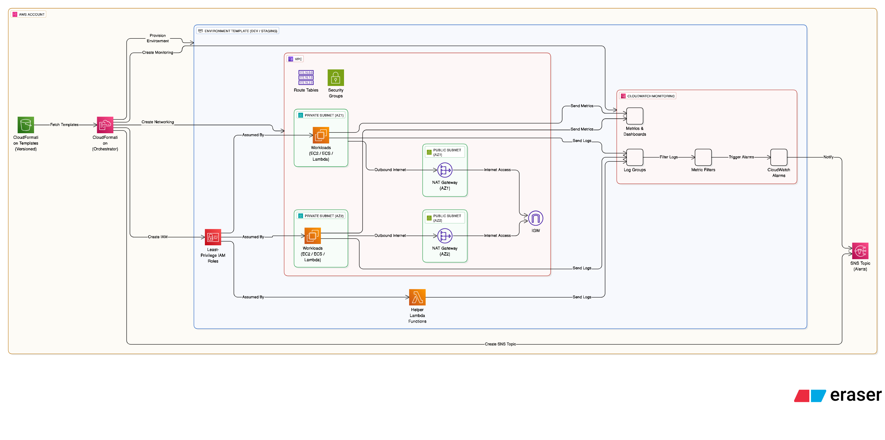

## CloudStartOps – Problem, Solution & Cost Analysis

### Problem Statement

Start-ups and small SaaS teams frequently build cloud environments manually, leading to long setup times, configuration drift, and gaps in monitoring. As these systems grow, teams face increased operational costs, inconsistent performance, and avoidable security risks. Designing a secure VPC architecture—with private subnets, controlled routing, and isolated workloads—is often time-consuming and error-prone without deep AWS expertise.

**CloudStartOps solves this by providing automated, repeatable environment provisioning.**

---

### Solution Design

CloudStartOps uses AWS CloudFormation to provision secure, consistent, and cost-efficient AWS environments. Each deployment creates a baseline VPC architecture with private subnets, NAT Gateways, route tables, and least-privilege IAM roles. Because all components are defined as templates, dev/staging environments remain uniform and free from configuration drift.

**Monitoring is built in:** CloudWatch log groups, dashboards, metric filters, and alarms are deployed automatically. SNS topics deliver alerts for events such as high CPU, failed health checks, or latency thresholds. Optional AWS Lambda helpers can perform scheduled checks, gather metadata, or automate remediation tasks.

**Environment settings — names, thresholds, alert recipients, and log retention periods — can be customised through configuration files without modifying the underlying templates.**

_The design emphasises ease of use, maintainability, and operational visibility, making it ideal for SMEs that need reliable infrastructure without unnecessary complexity._

The diagram below, built using Eraser, represents the high-level architecture of **CloudStartOps** showing how AWS services interact to provide automated provisioning, secure networking, and proactive monitoring.

---

### Cost Analysis

CloudStartOps is designed to minimise ongoing AWS spend while ensuring essential monitoring and resilience. CloudFormation itself has no direct cost, so teams only pay for the resources created.

The main cost drivers are:

1. NAT Gateways – a typical deployment uses two (one per AZ). By standardising subnet design and preventing accidental over-provisioning, teams avoid unnecessary NAT charges.

2. CloudWatch Logs & Metrics – costs remain low because retention periods and custom metrics are predefined and controlled.

3. SNS Notifications – email alerts are effectively free; SMS or webhook notifications remain low-cost.

By enforcing consistent architectures and avoiding misconfigured or redundant infrastructure, **CloudStartOps saves approximately £30 per environment per month, primarily through optimised NAT usage, centralised logging rules, and reduced manual troubleshooting.**

Overall, the framework delivers strong cost efficiency by minimising human error and preventing avoidable cloud spend.

---
